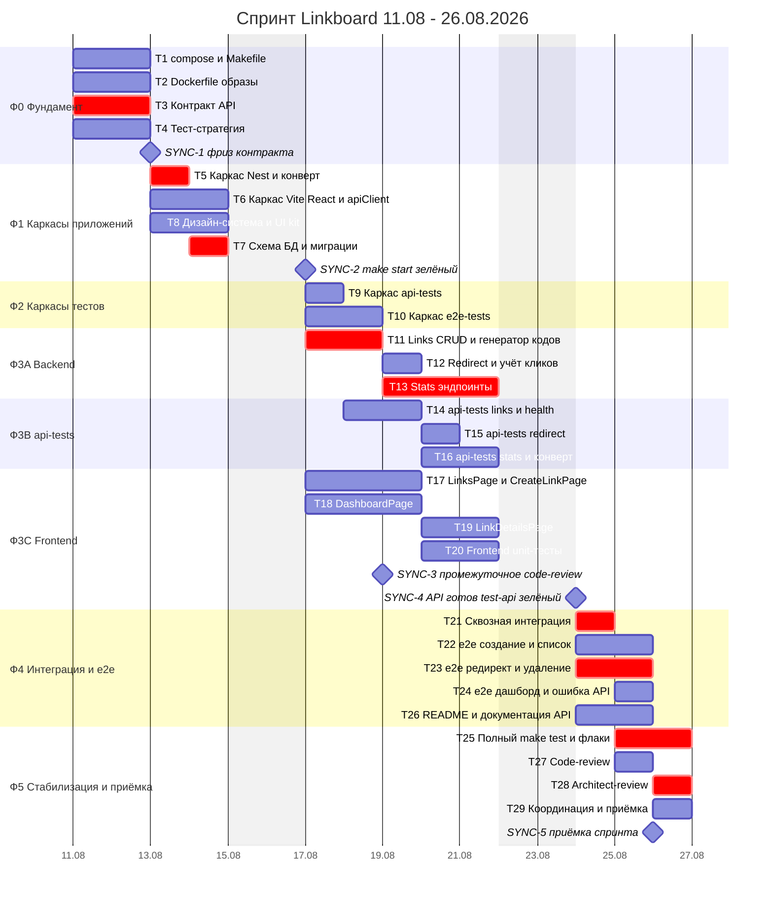

# Спринт Linkboard — план работ

**Спринт:** 11.08.2026 — 26.08.2026 (12 рабочих дней)
**Основание:** `docs/plans/linkboard.md` (архитектурный план, версия от 11.08.2026)
**Конвенции:** `CLAUDE.md` в корне репозитория
**Стартовое состояние:** пустой репозиторий, кода нет — весь код спринта пишется с нуля

---

## 1. Цель спринта и Definition of Done

### 1.1. Цель

Довести Linkboard до состояния **работающего v1**: сервис коротких ссылок с публичным редиректом, учётом кликов и admin-panel с аналитикой, поднимающийся одной командой `make start` и полностью покрытый тремя уровнями тестов (unit / api-tests / e2e-tests).

### 1.2. Definition of Done спринта

Спринт считается завершённым, когда **одновременно** выполнены все пункты:

| # | Критерий | Как проверяется |
|---|---|---|
| DoD-1 | `make start` на чистой машине поднимает postgres + backend + frontend, все три контейнера в статусе `healthy` | `make start && make ps` |
| DoD-2 | `make stop`, `make restart`, `make clean` отрабатывают без ошибок и без осиротевших контейнеров | ручной прогон цикла |
| DoD-3 | Миграции применяются автоматически при старте backend; `make migrate` идемпотентен | `make start` на пустом volume + повторный `make migrate` |
| DoD-4 | Реализованы все 13 эндпоинтов из раздела 3 архплана, включая `GET /:code` | `make test-api` |
| DoD-5 | Все API-ответы соответствуют конверту `{ data, error }` с инвариантом `data XOR error` | контрактные проверки в api-tests |
| DoD-6 | `make test-unit` — зелёный (unit backend + unit frontend) | CI-прогон / локально |
| DoD-7 | `make test-api` — зелёный, проект `api-tests/` не импортирует исходники backend | `make test-api` + проверка `api-tests/package.json` |
| DoD-8 | `make test-e2e` — зелёный, реализованы все 10 сценариев из раздела 5.4 архплана | `make test-e2e` + `make e2e-report` |
| DoD-9 | `make test` (unit → api → e2e) проходит целиком с первого раза, без ручных шагов между стадиями | полный прогон |
| DoD-10 | Admin-panel: 5 маршрутов (`/`, `/links`, `/links/new`, `/links/:id`, `*`) работают против реального backend, без msw в рантайме | ручная приёмка + e2e |
| DoD-11 | README описывает запуск, структуру, команды Makefile и контракт API | ревью general-purpose + code-reviewer |
| DoD-12 | Пройдены code-review и architect-review, все блокирующие замечания закрыты | отчёты ревью-агентов |
| DoD-13 | Ни один тест не флакует: `make test-e2e` прогнан 3 раза подряд зелёным | тройной прогон на стадии стабилизации |

### 1.3. Что явно НЕ входит в спринт

Авторизация admin-panel, GeoIP-обогащение поля `country`, rollup-агрегаты кликов, rate limiting, CI-пайплайн в `.github/` (создаётся только заготовка директории), prod-таргет Dockerfile проверяется на сборку, но не деплоится.

---

## 2. Разбивка на задачи

Единица оценки — **условный час (у.ч.)** работы одного агента. 1 условный день = 8 у.ч.
Суммарная ёмкость спринта: **420 у.ч. ≈ 52,5 агент-дней** при 12 календарных рабочих днях → средняя параллельность **4–5 агентов**.

### Фаза 0 — Фундамент (D1–D2)

| ID | Задача | Что делается | Артефакты | Оценка | Зависимости | Агент |
|---|---|---|---|---|---|---|
| **T1** | Каркас репозитория, docker-compose, Makefile | Структура директорий из раздела 7 архплана; `docker-compose.yml` с сервисами postgres/backend/frontend и profiles `test`/`e2e`; healthcheck'и и `depends_on: service_healthy`; volume `pgdata`; полный Makefile из раздела 6.2; `.env.example`; `.gitignore` | `Makefile`, `docker-compose.yml`, `.env.example`, `.gitignore`, `docker/`, каркас директорий `backend/ frontend/ api-tests/ e2e-tests/ .github/` | 16 | — | `devops-engineer` |
| **T2** | Dockerfile'ы и образы | Multi-stage `backend/Dockerfile` (target `dev` с hot-reload и `prod`), `frontend/Dockerfile` (dev-сервер Vite на 3000), `api-tests/Dockerfile`, `e2e-tests/Dockerfile` от `mcr.microsoft.com/playwright`; слоевое кеширование зависимостей; `.dockerignore` в каждом проекте | `backend/Dockerfile`, `frontend/Dockerfile`, `api-tests/Dockerfile`, `e2e-tests/Dockerfile`, `*/.dockerignore` | 16 | — | `devops-engineer` |
| **T3** | Контракт API — единый источник правды | Формализация раздела 3 архплана: сигнатуры всех 13 эндпоинтов, query-параметры и дефолты, DTO запросов/ответов, полный реестр `error.code`, правила пагинации, формат дат, поведение конверта, CORS-политика. Публикуется как OpenAPI-спека + TS-типы, которые независимо потребляют backend, frontend и api-tests | `docs/api/openapi.yaml`, `docs/api/contract.md`, `docs/api/error-codes.md` | 16 | — | `api-designer` |
| **T4** | Тест-стратегия и матрица покрытия | Раскладка кейсов из раздела 5 архплана по уровням: что проверяется unit, что api-tests, что e2e; матрица «эндпоинт × уровень»; правила изоляции (TRUNCATE, отдельная БД `linkboard_test`); политика флаков и ретраев; definition of done для тестового трека | `docs/testing/strategy.md`, `docs/testing/coverage-matrix.md` | 12 | — | `qa-expert` |

### Фаза 1 — Каркасы приложений (D3–D4)

| ID | Задача | Что делается | Артефакты | Оценка | Зависимости | Агент |
|---|---|---|---|---|---|---|
| **T5** | Каркас Nest.js + конверт `{ data, error }` | `main.ts` на порту 8080, глобальный префикс `/api` для API-модулей, CORS на `http://localhost:3000`; `TransformInterceptor` (оборачивает успешный ответ), `HttpExceptionFilter` (маппит HttpException → `{ data: null, error }`, неизвестное → 500 `INTERNAL_ERROR` без stack trace); `ValidationPipe` с `class-validator` → 400 `VALIDATION_ERROR` + `details`; env-конфиг; `GET /api/health`; `vitest.config.ts` для unit | `backend/package.json`, `backend/tsconfig.json`, `backend/vitest.config.ts`, `backend/src/main.ts`, `backend/src/app.module.ts`, `backend/src/config/`, `backend/src/common/interceptors/transform.interceptor.ts`, `backend/src/common/filters/http-exception.filter.ts`, `backend/src/common/dto/pagination.dto.ts`, `backend/src/health/` | 8 | T1, T2, T3 | `backend-developer` |
| **T6** | Каркас Vite + React, apiClient, роутинг | Vite на порту 3000, `QueryClientProvider` + `BrowserRouter`, `Layout` с сайдбаром и `Outlet`, 5 маршрутов-заглушек, `apiClient` на fetch (разворачивает конверт, бросает типизированный `ApiError`, сетевые ошибки → `NETWORK_ERROR`), файлы хуков `api/links.ts` и `api/stats.ts` по контракту T3, инфраструктура msw (handlers + setup) для разработки и unit-тестов | `frontend/package.json`, `frontend/vite.config.ts`, `frontend/vitest.config.ts`, `frontend/index.html`, `frontend/src/main.tsx`, `frontend/src/App.tsx`, `frontend/src/api/{client,links,stats,types}.ts`, `frontend/src/components/layout/`, `frontend/src/test/{setup.ts,msw-handlers.ts}` | 16 | T1, T2, T3 | `frontend-developer` |
| **T7** | Схема БД, миграции, индексы | Entities `Link` и `ClickEvent` по DDL из раздела 2.1; `data-source.ts`; первая миграция (таблицы + `uq_links_code` + три индекса); `migrationsRun: true` в dev-профиле; `docker/postgres/init.sql` с созданием `linkboard_test`; проверка планов запросов агрегатов на индексах | `backend/src/database/data-source.ts`, `backend/src/database/migrations/*`, `backend/src/links/entities/link.entity.ts`, `backend/src/stats/entities/click-event.entity.ts`, `docker/postgres/init.sql` | 8 | T5 (+T2) | `backend-developer` |
| **T8** | Дизайн-система admin-panel | Токены (цвета, типографика, отступы, радиусы), базовые компоненты `shared/`: `Card`, `Table`, `Spinner`, `ErrorState`, `EmptyState`, `CopyButton`, `ConfirmDialog`, `Toast`, `DateRangePicker`; правила состояний loading/empty/error; визуальный язык таблиц и графиков (палитра для recharts) | `frontend/src/styles/tokens.css`, `frontend/src/components/shared/*`, `docs/design/ui-kit.md` | 16 | T1 | `ui-designer` |

### Фаза 2 — Каркасы тестовых проектов (D5–D6)

| ID | Задача | Что делается | Артефакты | Оценка | Зависимости | Агент |
|---|---|---|---|---|---|---|
| **T9** | Каркас проекта `api-tests` | Отдельный npm-проект без зависимостей от исходников backend; `vitest.config.ts`; хелперы: `api-client.ts` (supertest по `API_URL` + разворот конверта + матчер инварианта `data XOR error`), `db.ts` (прямое подключение к `linkboard_test`, TRUNCATE между тестами), `seed.ts` (сид ссылок и кликов с заданными `occurred_at` и `ip_hash`), `wait-for-health.ts`; интеграция сервиса `api-tests` в compose под profile `test` и в `make test-api` | `api-tests/package.json`, `api-tests/tsconfig.json`, `api-tests/vitest.config.ts`, `api-tests/support/{api-client,db,seed,wait-for-health}.ts`, `api-tests/src/health.spec.ts` | 8 | T3, T4, T5, T7 | `qa-expert` |
| **T10** | Каркас проекта `e2e-tests` | Playwright-проект: `playwright.config.ts` (projects `chromium` обязательный и `webkit` опциональный, `trace: on-first-retry`, `video: retain-on-failure`, HTML-репортер в смонтированную наружу директорию); `global-setup.ts` (ожидание стека + очистка БД); фикстуры `api.ts` (подготовка данных через API, не кликами) и `db.ts`; скелеты page objects; интеграция сервиса в compose под profile `e2e`, `make test-e2e` и `make e2e-report` | `e2e-tests/package.json`, `e2e-tests/playwright.config.ts`, `e2e-tests/global-setup.ts`, `e2e-tests/fixtures/{api,db}.ts`, `e2e-tests/pages/*`, `e2e-tests/.gitignore` | 16 | T1, T2, T4, T6 | `qa-expert` |

### Фаза 3 — Функционал (D5–D9), три параллельных трека

**Трек A — Backend**

| ID | Задача | Что делается | Артефакты | Оценка | Зависимости | Агент |
|---|---|---|---|---|---|---|
| **T11** | Links CRUD + CodeGeneratorService | `POST/GET/GET:id/PATCH/DELETE /api/links`; генерация base62-кода длиной 7 через `crypto.randomInt`, retry на 23505 до 5 попыток → `CODE_GENERATION_FAILED`; валидация `customCode` (3–16 base62, резерв-список `api`/`health` → 409 `CODE_TAKEN`); валидация URL (только http/https, ≤ 2048); пагинация/поиск ILIKE/сортировка; маппинг entity → DTO с построением `shortUrl` из `BASE_URL`; unit-спеки генератора и сервиса | `backend/src/links/{links.module,links.controller,links.service,code-generator.service}.ts`, `backend/src/links/dto/*`, `backend/src/links/*.spec.ts` | 16 | T3, T5, T7 | `backend-developer` |
| **T12** | Redirect + учёт кликов | `GET /:code` регистрируется последним, не перехватывает `/api/*`; 302 + `Location` + `Cache-Control: no-store`; запись `click_events` (referer, user_agent, sha256(ip + суточная соль)) после отправки ответа, ошибка записи только логируется; инкремент `links.clicks_count` в той же транзакции; 404 `LINK_NOT_FOUND`, 410 `LINK_DISABLED` без учёта клика; unit-спеки | `backend/src/redirect/{redirect.module,redirect.controller,redirect.service}.ts`, `backend/src/redirect/*.spec.ts` | 8 | T11 | `backend-developer` |
| **T13** | Stats-эндпоинты | 6 эндпоинтов: `/api/links/:id/stats/{daily,referers,user-agents}` и `/api/stats/{summary,daily,top}`; непрерывный ряд дней с нулями; `uniqueVisitors` по `ip_hash`; нормализация referer до хоста и `(direct)`; парсинг UA через `ua-parser-js` с группировкой по браузерам и типам устройств; `clicksToday` по UTC-границе дня; `top` считается по `click_events` внутри `from/to`, а не по `clicks_count`; валидация диапазона (`from > to`, > 366 дней → 400); unit-спеки | `backend/src/stats/{stats.module,stats.controller,stats.service}.ts`, `backend/src/stats/dto/*`, `backend/src/stats/*.spec.ts` | 24 | T7, T11 | `backend-developer` |

**Трек B — api-tests (пишутся по контракту T3 параллельно бэкенду, стартуют «красными»)**

| ID | Задача | Что делается | Артефакты | Оценка | Зависимости | Агент |
|---|---|---|---|---|---|---|
| **T14** | api-tests: links CRUD + health | Кейсы из 5.2: создание (201, code длиной 7, customCode, повтор → 409, резерв → 409, невалидный URL/схема/пустое тело → 400 с details); список (пустая БД, пагинация 25→20+5, `search` по title и code, сортировка по `clicks_count desc`, `limit=1000` → 400); `GET/PATCH/DELETE /:id` (404, нечисловой id → 400, каскадное удаление `click_events`); health и `DB_UNAVAILABLE` | `api-tests/src/links.spec.ts`, `api-tests/src/health.spec.ts` | 16 | T3, T9 | `qa-expert` |
| **T15** | api-tests: redirect и учёт кликов | 302 + точный `Location` + `no-store`; 3 перехода → `clicksCount === 3` и 3 строки в `click_events` с referer/user_agent из заголовков; неизвестный код → 404; `isActive: false` → 410 и клик НЕ записан; редирект-роут не перехватывает `/api/...` | `api-tests/src/redirect.spec.ts` | 8 | T3, T9 | `qa-expert` |
| **T16** | api-tests: stats-агрегаты | Сид кликов с заданными `occurred_at`/`ip_hash`/referer/UA → суммы по дням, нули для пустых дней, `uniqueVisitors`; `from > to` → 400; несуществующий id → 404; сортировка referers и `(direct)`; группировка UA; `summary`/`daily`/`top` сходятся с сидом, `top` учитывает только период; сквозная проверка инварианта конверта на всех кейсах | `api-tests/src/stats.spec.ts`, `api-tests/src/envelope.spec.ts` | 16 | T3, T9 | `qa-expert` |

**Трек C — Frontend (на msw-моках по контракту T3)**

| ID | Задача | Что делается | Артефакты | Оценка | Зависимости | Агент |
|---|---|---|---|---|---|---|
| **T17** | LinksPage + CreateLinkPage | `LinksToolbar` (поиск с debounce 300ms, сортировка, кнопка создания), `LinksTable` (код + CopyButton, URL, title, клики, дата, active-toggle), `Pagination` с состоянием в URL search params; `LinkForm` → `POST /api/links`, успех → редирект на `/links/:id` + toast, 409 `CODE_TAKEN` под полем alias, кнопка задизейблена во время запроса; empty state и error state | `frontend/src/pages/{LinksPage,CreateLinkPage,NotFoundPage}.tsx`, `frontend/src/components/links/{LinksTable,LinksToolbar,LinkForm}.tsx` | 24 | T3, T6, T8 | `frontend-developer` |
| **T18** | DashboardPage | `SummaryCards` (4 карточки из `stats/summary`), `ClicksChart` на recharts с переключателем 7/30/90 дней (переиспользуемый компонент — контракт пропсов согласуется с T19), `TopLinksTable` с переходом по строке на `/links/:id`; `staleTime: 60s` для статистики | `frontend/src/pages/DashboardPage.tsx`, `frontend/src/components/stats/{SummaryCards,ClicksChart,TopLinksTable}.tsx` | 24 | T3, T6, T8 | `frontend-developer` |
| **T19** | LinkDetailsPage | `LinkHeader` (shortUrl + copy, inline-edit title, toggle active, delete с `ConfirmDialog`), переиспользование `ClicksChart` в режиме двух линий (клики + уникальные), `ReferersTable`, `UserAgentsPanel` (два графика: браузеры и устройства); мутации PATCH/DELETE с инвалидацией `['links']` и `['stats']` | `frontend/src/pages/LinkDetailsPage.tsx`, `frontend/src/components/links/LinkHeader.tsx`, `frontend/src/components/stats/{ReferersTable,UserAgentsPanel}.tsx` | 16 | T17, T18 | `frontend-developer` |
| **T20** | Frontend unit-тесты | Кейсы из 5.3: `apiClient` (разворот `data`, `ApiError` по `error`, `NETWORK_ERROR`), `LinkForm` (тело POST, 409 у поля alias, disabled), `LinksTable` (рендер/empty/error, clipboard в CopyButton), `LinksToolbar` (debounce + URL params), `DashboardPage` (значения карточек, спиннер), `ClicksChart` (переключатель периода меняет параметры запроса), смоук роутинга `/` → `/links` → `/links/:id` | `frontend/src/**/*.spec.tsx`, дополнение `frontend/src/test/msw-handlers.ts` | 16 | T17, T18 | `frontend-developer` |

### Фаза 4 — Интеграция и e2e (D10–D11)

| ID | Задача | Что делается | Артефакты | Оценка | Зависимости | Агент |
|---|---|---|---|---|---|---|
| **T21** | Сквозная интеграция фронт ↔ бэк | Отключение msw в рантайме (остаётся только в тестах), `VITE_API_URL` из окружения, проверка CORS на реальных запросах, сверка фактических ответов backend с ожиданиями хуков, отладка инвалидации кеша после мутаций, обработка 404/410/500 в UI, устранение расхождений с контрактом (правки по обе стороны) | правки в `frontend/src/api/*`, `frontend/src/main.tsx`, точечные правки `backend/src/**`, `docker-compose.yml` (env) | 8 | T13, T19, T20 | `general-purpose` |
| **T22** | e2e: создание, список, пустое состояние | Сценарии 1, 2, 3, 5, 9: создание ссылки с проверкой clipboard; занятый alias без навигации; валидация `not-a-url` без ухода запроса (счётчик через `page.route`); список с сидом 25 через API — пагинация, поиск, сортировка, сохранение состояния в URL после перезагрузки; empty state на чистой БД | `e2e-tests/specs/{create-link,links-list}.spec.ts`, `e2e-tests/pages/{LinksPage,LinkFormPage}.ts` | 16 | T10, T21 | `qa-expert` |
| **T23** | e2e: редирект, отключение, удаление | Сценарии 4, 6, 7: переход по короткой ссылке в новой вкладке → возврат в админку → рост счётчика, появление точки на графике и строки в referers; toggle active → короткая ссылка отдаёт 410 и счётчик не растёт; delete с диалогом подтверждения → исчезновение из списка и «не найдено» на странице деталей | `e2e-tests/specs/{redirect-and-clicks,link-details}.spec.ts`, `e2e-tests/pages/LinkDetailsPage.ts` | 16 | T10, T21 | `qa-expert` |
| **T24** | e2e: дашборд и деградация API | Сценарии 8, 10: сид кликов за разные дни → корректные карточки, переключатель 7/30/90 перерисовывает график, клик по строке топа ведёт на страницу ссылки; подмена ответа на 500 через `page.route` → `ErrorState` в UI, приложение не падает | `e2e-tests/specs/dashboard.spec.ts`, `e2e-tests/pages/DashboardPage.ts` | 8 | T10, T18, T21 | `qa-expert` |
| **T26** | README и документация API | README (что за сервис, быстрый старт, таблица команд Makefile, структура репозитория, переменные окружения, как гонять каждый уровень тестов, как смотреть отчёт Playwright), актуализация `docs/api/contract.md` по факту реализации, обновление `CLAUDE.md` (секция Project Status и фактический стек) | `README.md`, `docs/api/contract.md`, `CLAUDE.md`, `api-tests/README.md`, `e2e-tests/README.md` | 16 | T13, T21 | `general-purpose` |

### Фаза 5 — Стабилизация и приёмка (D11–D12)

| ID | Задача | Что делается | Артефакты | Оценка | Зависимости | Агент |
|---|---|---|---|---|---|---|
| **T25** | Полный прогон `make test` и стабилизация | Прогон `make test` от `make clean` на чистом окружении; устранение гонок «тесты стартовали раньше стека» (healthcheck'и, `service_healthy`, `wait-for-health`); тройной прогон `make test-e2e` на флаки; проверка exit code one-shot тестовых сервисов и его проброса в `make`; `make db-reset` перед прогонами; проверка, что `make start` не тянет образ Playwright | правки `docker-compose.yml`, `Makefile`, `e2e-tests/playwright.config.ts`, `api-tests/support/wait-for-health.ts` | 16 | T22, T23, T24 | `devops-engineer` |
| **T27** | Code-review всей кодовой базы | Ревью backend, frontend и обоих тестовых проектов: соответствие конвенциям `CLAUDE.md`, единообразие обработки ошибок, отсутствие утечки внутренностей в ответах, отсутствие зависимости `api-tests`/`e2e-tests` от исходников приложения, качество селекторов и page objects, мёртвый код, забытые `console.log`/`.only`/`.skip` | отчёт ревью, issue-лист блокеров | 8 | T21, T22, T23, T24, T26 | `code-reviewer` |
| **T28** | Финальный architect-review | Сверка реализации с `docs/plans/linkboard.md`: границы модулей, соблюдение конверта на уровне интерсептора, порядок регистрации редирект-роута, индексы под фактические агрегаты, корректность профилей compose, задел под guards/GeoIP/rollup — не сломан ли; фиксация технического долга в бэклог следующего спринта | отчёт архитектурного ревью, `docs/plans/tech-debt.md` | 8 | T25, T27 | `code-reviewer` |
| **T29** | Координация спринта и приёмка | Сквозная координация параллельных треков, синхронизация контракта между агентами, разруливание конфликтов в общих файлах (`docker-compose.yml`, `Makefile`), ведение точек синхронизации, финальная демонстрация и прогон чек-листа приёмки | журнал координации, отчёт приёмки | 8 | все | координатор (основная сессия) |

**Итого: 29 задач, 420 у.ч.**

---

## 3. Матрица параллельности

### 3.1. Волны

| Волна | Дни | Задачи (идут одновременно) | Агентов параллельно | Почему параллельно |
|---|---|---|---|---|
| **W0** | D1–D2 | T1, T2, T3, T4 | 4 | Пересечений по файлам нет: инфра, образы, контракт и тест-стратегия — четыре независимых артефакта. Контракт T3 намеренно вынесен в самое начало, потому что он расшивает три трека сразу |
| **W1** | D3–D4 | T5, T6, T7, T8 | 4 | T5 и T6 — разные проекты (backend/frontend), оба стоят на общем фундаменте W0. T8 (дизайн-система) не требует apiClient — компоненты `shared/` самодостаточны. T7 стартует на D4, сразу после появления Nest-каркаса, куда встают entities и миграции |
| **W2** | D5–D6 | T9, T10, T11, T17, T18 | 5 | Каркасы тестовых проектов поднимаются **до** написания фич — именно чтобы api-tests и e2e писались параллельно бэкенду. Фронтенд-страницы стоят на msw-моках по контракту T3 и не ждут backend |
| **W3** | D7–D9 | T12, T13, T14, T15, T16, T19, T20 | 5–6 | Пик параллельности: два инстанса backend-developer (redirect и stats независимы друг от друга после T11), два инстанса qa-expert (разные spec-файлы), фронтенд добивает детали и unit |
| **W4** | D10–D11 | T21, T22, T23, T24, T26 | 4–5 | e2e-спеки пишутся параллельно интеграции T21 и гоняются «в зелёную» по мере её завершения; документация пишется параллельно, поскольку контракт уже заморожен |
| **W5** | D11–D12 | T25, T27, T28, T29 | 3–4 | T27 (code-review) идёт параллельно T25 (стабилизация инфры) — они не конкурируют; T28 закрывает после обоих |

### 3.2. Строго последовательные связки и обоснование

| Связка | Почему нельзя параллелить |
|---|---|
| T1/T2 → T5, T6 | Пока нет compose и Dockerfile'ов, приложения негде запустить и нечем проверить, что каркас вообще стартует |
| T3 → T5, T6, T9, T14–T16 | Контракт — единственный источник правды для трёх независимых потребителей. Если начать раньше фриза, backend, frontend и api-tests разъедутся по именам полей и кодам ошибок, и интеграция T21 превратится в переписывание |
| T5 → T7 | Entities и миграции TypeORM физически живут внутри Nest-проекта и требуют `data-source.ts` и конфигурации |
| T7 → T11, T13 | Без таблиц `links` и `click_events` нет ни CRUD, ни агрегатов |
| T11 → T12, T13 | Redirect ищет ссылку, а stats агрегирует клики — обоим нужны `LinksModule` и маппинг entity → DTO |
| T17/T18 → T19 | `LinkDetailsPage` переиспользует `ClicksChart` из T18 и паттерны таблиц из T17. Делать раньше — гарантированный конфликт и дублирование компонентов |
| T13, T19, T20 → T21 | Интеграция имеет смысл только когда API готов целиком и все страницы существуют; иначе она будет выполняться N раз |
| T21 → T22, T23, T24 (для **прогона**) | Playwright работает против живого стека с реальным backend. Написание спеков и page objects стартует параллельно T21 (по готовой вёрстке и заранее согласованным `data-testid`), но первый зелёный прогон возможен только после интеграции |
| T22/T23/T24 → T25 | Стабилизировать `make test` можно только когда есть полный набор тестов, который в этом `make test` гоняется |
| T25, T27 → T28 | Архитектурное ревью принимает результат, а не полуфабрикат |

### 3.3. Критический путь

```
T3 (16 у.ч.) → T5 (8) → T7 (8) → T11 (16) → T13 (24) → T21 (8) → T23 (16) → T25 (16) → T28 (8)
```

**Длина: 120 у.ч. = 12 рабочих дней = вся длительность спринта.** Резерва на критическом пути нет.

Задачи вне критического пути и их запас (slack):

| Задача | Запас | Комментарий |
|---|---|---|
| T2 (Dockerfile'ы) | ~0,5 дня | почти критическая — задержка образов сдвинет T5 |
| T4 (тест-стратегия) | 2 дня | нужна к старту T9 |
| T6, T8 (каркас фронта, дизайн-система) | 1 день | нужны к старту T17/T18 |
| T10 (каркас e2e) | 4 дня | нужен только к D10 |
| T14–T16 (api-tests) | 1–2 дня | пишутся «красными», зелёными становятся по мере готовности бэкенда |
| T17, T18 (страницы) | 1 день | сходятся к T19 |
| T26 (документация) | 1 день | ограничена только T27 |

**Практический вывод для координатора (T29):** любая просрочка на **T3, T5, T7, T11 или T13** сдвигает конец спринта день в день. Эти пять задач получают приоритет по ресурсам и ежедневный контроль. Первый кандидат на сокращение скоупа при отставании — T13: эндпоинты `stats/user-agents` и `stats/top` можно вынести за спринт, сохранив дашборд и `daily`/`summary`/`referers`.

---

## 4. Диаграмма Ганта



Красным (`crit`) отмечен критический путь: T3 → T5 → T7 → T11 → T13 → T21 → T23 → T25 → T28.

---

## 5. Точки синхронизации и ревью

| Точка | Когда | Участники | Что проверяется | Выход |
|---|---|---|---|---|
| **SYNC-1 — Фриз контракта API** | конец D2 (13.08) | `code-reviewer`, `api-designer`, `backend-developer`, `frontend-developer`, `qa-expert` | Полнота OpenAPI-спеки: все 13 эндпоинтов, все query-параметры и дефолты, полный реестр `error.code`, формат пагинации и дат, поведение конверта в краевых случаях. Согласование `data-testid` для будущих e2e | **Блокирующая точка.** Контракт заморожен. Дальнейшие изменения — только через явное решение координатора с уведомлением всех трёх треков |
| **SYNC-2 — Каркас поднимается** | конец D4 (17.08, утро) | `code-reviewer`, `devops-engineer`, `backend-developer` | `make start` от `make clean` поднимает три контейнера в `healthy`; `GET /api/health` возвращает `{ data: { status: "ok", db: "up" }, error: null }`; миграции применились; `linkboard_test` создана; фронт открывается на :3000; `make stop/restart/clean` работают | **Блокирующая точка.** Без неё бессмысленно стартовать W2 — тестовые проекты некуда нацеливать |
| **SYNC-3 — Промежуточное ревью бэкенда** | конец D6 / начало D7 (19.08) | `code-reviewer`, `backend-developer`, `qa-expert` | Links CRUD реализован, api-tests T14 позеленели; проверяется корректность конверта на реальных ответах, коды ошибок совпадают с реестром, unit-спеки генератора кодов покрывают retry и резерв-список | Не блокирующая, но замечания обязательны к исправлению до SYNC-4. Ранняя ловля системных ошибок в паттернах, пока их не размножили на stats и redirect |
| **SYNC-4 — API готов** | конец D9 / начало D10 (24.08) | `qa-expert`, `backend-developer`, `general-purpose` | `make test-api` зелёный целиком (T14+T15+T16); матрица покрытия из T4 закрыта; unit-тесты backend зелёные; фронтенд-страницы существуют и проходят unit на msw | **Блокирующая точка.** Зелёный свет на интеграцию T21 и на прогон e2e. Именно здесь ловятся расхождения «контракт vs реализация», пока их дёшево чинить |
| **SYNC-5 — Приёмка спринта** | D12 (26.08) | все агенты, ведёт координатор (основная сессия) | Прогон чек-листа из раздела 8, демонстрация сценариев в живом стеке, отчёты code-review и architect-review, фиксация техдолга | Спринт принят / принят с оговорками / не принят |

**Интеграционные проверки вне точек синхронизации:**

- После каждой задачи трека A — прогон соответствующего spec-файла из `api-tests` (`make test-api`), чтобы «красное» становилось «зелёным» сразу, а не пачкой в конце.
- Ежедневный smoke координатора (T29): `make clean && make start && make test-unit` — ловит разрушение каркаса общими правками в `docker-compose.yml` и `Makefile`.
- Конфликтные файлы (`docker-compose.yml`, `Makefile`, `.env.example`, `frontend/src/api/types.ts`) редактируются только по согласованию с координатором — они правятся несколькими треками.

---

## 6. Риски спринта и митигация

| # | Риск | Вероятность | Влияние | Митигация |
|---|---|---|---|---|
| R1 | Контракт API «поплыл» после SYNC-1 — треки разъехались, интеграция T21 вырождается в переписывание | Средняя | Высокое | Жёсткий фриз на SYNC-1; TS-типы из T3 — единственный источник для frontend и api-tests; любое изменение контракта проходит через координатора с обязательным уведомлением трёх треков; T14–T16 «красные» ловят расхождение уже на D6 |
| R2 | Гонки старта в compose: тесты стартуют раньше готовности стека → плавающие падения | Высокая | Среднее | `healthcheck` + `depends_on: service_healthy` на всех сервисах (T1); `wait-for-health.ts` в api-tests и `global-setup.ts` в e2e как второй эшелон; отдельная задача T25 на стабилизацию с тройным прогоном |
| R3 | Флакующие e2e: асинхронная запись клика гоняется с проверкой счётчика в UI | Высокая | Среднее | Запись клика в T12 делается в транзакции с инкрементом; в e2e — только web-first assertions Playwright с ретраями (`expect.toHaveText`), никаких `waitForTimeout`; `trace: on-first-retry` для диагностики; критерий DoD-13 — три зелёных прогона подряд |
| R4 | Редирект-роут `GET /:code` перехватывает `/api/*` или статику | Средняя | Высокое | Глобальный префикс `/api` для API-модулей и регистрация `RedirectModule` последним (T5, T12); отдельный api-test на «редирект не перехватывает `/api/...`» (T15); проверка на architect-review |
| R5 | Просрочка T13 (stats) — самая объёмная задача на критическом пути | Средняя | Высокое | Ранний старт (D7, сразу после T11, параллельно T12 вторым инстансом backend-developer); заранее согласованный план сокращения скоупа: `stats/user-agents` и `stats/top` выносятся за спринт, дашборд остаётся рабочим на `summary` + `daily` |
| R6 | Playwright-образ (~1,5 ГБ) тянется в `make start` и убивает быстрый старт | Низкая | Среднее | Тестовые сервисы только под profiles `test`/`e2e` (T1); явная проверка в чек-листе приёмки: `make start` не скачивает образ Playwright |
| R7 | Конфликты правок в общих файлах (`docker-compose.yml`, `Makefile`, `types.ts`) между параллельными агентами | Высокая | Низкое | Реестр «горячих» файлов у координатора (T29), правки только через него; тестовые сервисы добавляются в compose самими тестовыми задачами T9/T10, а не задним числом |
| R8 | Дизайн-система (T8) готова позже, чем нужна страницам T17/T18 → переделка вёрстки | Средняя | Среднее | T8 идёт в W1, на день раньше страниц; на D3 фиксируются публичные API компонентов `shared/` (пропсы), реализация может дозревать параллельно |
| R9 | Тестовая БД `linkboard_test` не изолирована — api-tests и e2e-tests затирают данные друг друга или dev-данные | Средняя | Среднее | Отдельная БД из `init.sql` (T7); TRUNCATE-хелпер в `support/db.ts` (T9) переиспользуется в e2e (T10); `make test` гоняет уровни строго последовательно; `make db-reset` перед прогонами |
| R10 | Индексы не покрывают фактические агрегаты — stats тормозят на реальном объёме | Низкая | Низкое | Проверка планов запросов в T7 после написания агрегатов в T13; вынесено в architect-review T28 как отдельный пункт |
| R11 | Ложное «зелёное»: api-tests случайно импортируют исходники backend и тестируют не то, что задеплоено | Низкая | Высокое | Отдельные `package.json` и `tsconfig.json` без ссылок на `../backend` (T9); supertest работает по `API_URL`, а не с инстансом Nest; явный пункт code-review (T27) и чек-листа приёмки |

---

## 7. Роли агентов в спринте

Названия ролей ниже — из актуального ростера `Agent` tool. Псевдонимов `voltagent-*`, под которыми задачи были размечены на этапе архитектурного планирования, в этой версии окружения больше нет. Там, где узкая роль исходного плана (`test-automator`, `docker-expert`, `database-administrator`, `architect-reviewer`, `fullstack-developer`, `documentation-engineer`, `multi-agent-coordinator`) не имеет прямого аналога, задача переназначена ближайшему по компетенции агенту; координация спринта (T29 и точки синхронизации) с самого начала фактически велась основной сессией напрямую, отдельным агентом никогда не была.

| Агент | Задачи | Загрузка, у.ч. |
|---|---|---|
| `devops-engineer` | T1, T2, T25 | 48 |
| `backend-developer` | T5, T7, T11, T12, T13 | 64 |
| `api-designer` | T3 | 16 |
| `frontend-developer` | T6, T17, T18, T19, T20 | 96 |
| `ui-designer` | T8 | 16 |
| `general-purpose` | T21, T26 | 24 |
| `qa-expert` | T4, T9, T10, T14, T15, T16, T22, T23, T24 | 116 |
| `code-reviewer` | SYNC-1, SYNC-2, T27, T28 | 24 |
| координатор (основная сессия, без отдельного агента) | T29 + все точки синхронизации | 8 |

Примечание: `qa-expert` и `frontend-developer` (и `backend-developer` на D7) работают **несколькими параллельными инстансами** — задачи внутри их треков разведены по разным файлам и не конфликтуют. Распределение инстансов остаётся зоной ответственности координатора основной сессии.

---

## 8. Чек-лист приёмки спринта

### Инфраструктура

- [ ] `make clean && make start` на чистой машине поднимает postgres, backend, frontend; все три в статусе `healthy`
- [ ] `make start` **не** скачивает образ Playwright (тестовые сервисы под profiles)
- [ ] `make stop`, `make restart`, `make logs`, `make logs s=backend`, `make ps`, `make psql` работают
- [ ] `make clean` удаляет контейнеры и volume, повторный `make start` поднимает всё с нуля
- [ ] Миграции применились автоматически, `make migrate` идемпотентен, `make migration name=...` генерирует файл
- [ ] База `linkboard_test` создана init-скриптом, `make db-reset` её пересоздаёт
- [ ] `.env.example` содержит все переменные, compose корректно читает `.env`

### Backend

- [ ] Backend слушает **8080**, все 13 эндпоинтов из раздела 3 архплана отвечают
- [ ] `GET /api/health` → `{ data: { status: "ok", db: "up" }, error: null }`; при упавшей БД → 503 `DB_UNAVAILABLE`
- [ ] Каждый JSON-ответ удовлетворяет инварианту `data XOR error`
- [ ] `GET /:code` → 302 + `Location` + `Cache-Control: no-store`; 404 `LINK_NOT_FOUND`; 410 `LINK_DISABLED` без учёта клика
- [ ] Редирект-роут не перехватывает `/api/*`
- [ ] Код генерируется длиной 7 из base62; занятый или зарезервированный alias → 409 `CODE_TAKEN`
- [ ] Валидация даёт 400 `VALIDATION_ERROR` с `details`; неизвестное исключение → 500 `INTERNAL_ERROR` без stack trace
- [ ] Удаление ссылки каскадно удаляет её `click_events`
- [ ] CORS разрешает origin `http://localhost:3000`

### Frontend

- [ ] Frontend слушает **3000**, все 5 маршрутов рендерятся против реального backend
- [ ] msw используется только в тестах, в рантайме отключён
- [ ] Создание ссылки: успех → переход на `/links/:id` + toast; 409 показывается под полем alias
- [ ] Список: пагинация, поиск с debounce, сортировка; состояние в URL search params переживает перезагрузку и «назад»
- [ ] Дашборд: 4 карточки, график с переключателем 7/30/90, переход по строке топа
- [ ] Страница деталей: copy короткой ссылки, edit title, toggle active, delete с подтверждением, график клики+уникальные, referers, user-agents
- [ ] Состояния loading / empty / error реализованы на всех страницах; при 500 от API виден `ErrorState`, приложение не падает

### Тесты

- [ ] `make test-unit` зелёный (backend + frontend)
- [ ] `make test-api` зелёный; `api-tests/` не имеет зависимостей от исходников backend
- [ ] Все 10 e2e-сценариев из раздела 5.4 архплана реализованы; `make test-e2e` зелёный
- [ ] `make test-e2e` прогнан 3 раза подряд без флаков
- [ ] `make test` проходит целиком (unit → api → e2e) без ручных шагов
- [ ] `make e2e-report` открывает HTML-отчёт; артефакты трасс и видео на месте
- [ ] Exit code упавшего теста корректно пробрасывается в `make` (проверено намеренным падением)
- [ ] Матрица покрытия из T4 закрыта; в коде нет `.only` и незакоммиченных `.skip`

### Документация и ревью

- [ ] README описывает запуск, структуру, все команды Makefile, переменные окружения и три уровня тестов
- [ ] `docs/api/contract.md` соответствует фактической реализации
- [ ] `CLAUDE.md` обновлён: секция Project Status отражает реальное состояние
- [ ] Code-review (T27) завершён, блокирующие замечания закрыты
- [ ] Architect-review (T28) завершён, расхождений с `docs/plans/linkboard.md` нет либо они осознанно зафиксированы
- [ ] Технический долг и отложенный скоуп (авторизация, GeoIP, rollup, rate limiting, CI) записаны в `docs/plans/tech-debt.md`

---

**Готовность к следующему спринту:** заделы, заложенные в v1 (слой guards, поле `country`, профили compose, независимые тестовые проекты, заготовка `.github/`), позволяют начать спринт 2 с авторизации и CI без перестройки архитектуры.
